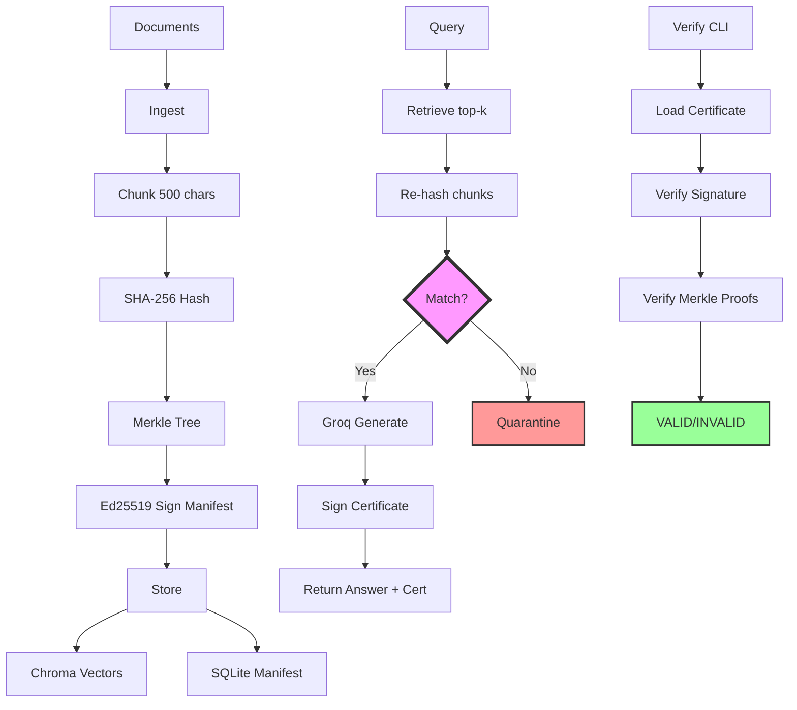

# ATTEST — cryptographic chain of custody for RAG answers

> SENTINEL stops sensitive data going into an LLM. ATTEST proves what came out of a RAG system is grounded in real, unaltered, timestamped source material.

**Status:** MVP Core + Integrity Monitor complete. See `PROJECT_PLAN.md` and `PROGRESS.md`.

## Quick Start

Use Python 3.11 or 3.12 for the full local backend stack. `chromadb` currently does not install cleanly on this Windows Python 3.14 environment.

### Backend

```bash
cd backend
copy .env.example .env
pip install -r requirements.txt
# Update `.env` with your signing key, Groq key, and allowed origins.
uvicorn app.main:app --reload
```

### Frontend

```bash
cd frontend
copy .env.example .env
npm install
npm run dev
```

## Architecture

ATTEST provides cryptographic proof that RAG answers are grounded in unaltered source material:

1. **Ingestion**: Documents are chunked, hashed (SHA-256), organized into a Merkle tree, and signed with Ed25519
2. **Query**: Retrieved chunks are re-hashed against the manifest before answer generation
3. **Certificate**: Answers include a self-contained certificate with Merkle proofs and signature
4. **Verification**: Standalone CLI verifies certificates without trusting the backend



## Integrity Monitor

The system includes three modes of integrity checking:

- **Lazy**: Every query re-hashes retrieved chunks against the manifest
- **Cron**: External cron job triggers full corpus health checks every 15 minutes
- **Manual**: Dashboard "Check Now" button triggers immediate health check

### Cron Configuration

To set up automated monitoring:

1. Go to [cron-job.org](https://cron-job.org)
2. Create a new cron job with:
   - **URL**: `https://your-app.onrender.com/monitor/trigger`
   - **Method**: POST
   - **Interval**: 15 minutes
   - **Headers**: None required

This keeps the Render instance warm and ensures regular integrity checks.

## Demo

See `DEMO.md` for the 90-second live demo script showing tamper detection and zero-trust verification.

## Zero-Trust Verification

Verify any certificate without trusting the backend:

```bash
python backend/verifier/verify.py \
  --certificate path/to/cert.json \
  --public-key backend/keys/public_key.pem
```

## Limitations

- No protection against pre-ingestion poisoning
- Compromised signing key breaks trust model
- No external transparency log in MVP (Rekor is Stretch)
- Reseed-on-boot resets manifest timestamp on cold start (acceptable for demo)

## Tech Stack

- **Backend**: FastAPI, ChromaDB, sentence-transformers, Groq
- **Crypto**: SHA-256, Ed25519 (cryptography library)
- **Frontend**: React + Vite + Tailwind
- **Deployment**: Render (backend), Vercel (frontend)

## Deployment

### Backend (Render)

1. Push code to GitHub
2. Create new Web Service on Render
3. Connect repository and select `attest/backend` as root directory
4. Build command: `pip install -r requirements.txt`
5. Start command: `uvicorn app.main:app --host 0.0.0.0 --port $PORT`
6. Environment variables:
   - `ATTEST_SIGNING_KEY_PEM`: Your Ed25519 private key (generate locally with `python -c "from cryptography.hazmat.primitives.asymmetric.ed25519 import Ed25519PrivateKey; from cryptography.hazmat.primitives import serialization; k=Ed25519PrivateKey.generate(); print(k.private_bytes(serialization.Encoding.PEM, serialization.PrivateFormat.PKCS8, serialization.NoEncryption()).decode())"`)
   - `ATTEST_GROQ_API_KEY`: Your Groq API key
   - `ATTEST_GROQ_MODEL`: `llama-3.3-70b-versatile` (or current free model)
   - `ATTEST_ALLOWED_ORIGINS`: Your Vercel app URL

### Frontend (Vercel)

1. Push code to GitHub
2. Import project on Vercel
3. Root directory: `attest/frontend`
4. Build command: `npm run build`
5. Output directory: `dist`
6. Environment variable: `VITE_API_URL` (your Render backend URL)

### Key Generation

Generate Ed25519 keypair locally once per deploy:

```bash
python -c "
from cryptography.hazmat.primitives.asymmetric.ed25519 import Ed25519PrivateKey
from cryptography.hazmat.primitives import serialization

k = Ed25519PrivateKey.generate()
private_pem = k.private_bytes(
    serialization.Encoding.PEM,
    serialization.PrivateFormat.PKCS8,
    serialization.NoEncryption()
)
public_pem = k.public_key().public_bytes(
    serialization.Encoding.PEM,
    serialization.PublicFormat.SubjectPublicKeyInfo
)

with open('private.pem', 'wb') as f:
    f.write(private_pem)
with open('public_key.pem', 'wb') as f:
    f.write(public_pem)

print('Keys generated. Commit public_key.pem, paste private.pem into Render env.')
"
```

Commit `backend/keys/public_key.pem` to the repository. Paste the private key content into Render's `ATTEST_SIGNING_KEY_PEM` environment variable.

## Evaluation

Run the evaluation harness to measure system performance:

```bash
cd attest
python eval/run_eval.py
```

This outputs metrics for:
- Tamper detection rate
- False positive rate
- Verification latency (p50)
- Proof size (mean)
- Ingestion throughput

## Related Work

- **ZKPROV** (arXiv 2506.20915): Training-data provenance via ZK. ATTEST = post-ingestion tamper detection in live RAG. Chose signed-hash over ZK for 4-week scope.
- **OWASP ASI06**: Memory & Context Poisoning — the threat category ATTEST addresses.
- **Sigstore/Rekor**: Conceptual model (transparency log). MVP = local Ed25519 only; Rekor = Stretch.

## Resume Bullets

Fill in the placeholders with actual numbers from `eval/run_eval.py`:

- Architected cryptographic chain-of-custody for agentic RAG (SHA-256 Merkle tree, Ed25519 signed manifests and answer certificates)
- Built integrity monitor with __% tamper detection, __% false-positive rate on __-doc eval set
- Zero-trust standalone verifier — Merkle proofs + signature check, __ ms verify latency, O(log n) proof size — addresses OWASP ASI06
- Implemented fail-closed RAG pipeline that quarantines tampered documents instead of returning poisoned answers
- Deployed full-stack system with React frontend, FastAPI backend, ChromaDB vector store, and Groq LLM integration
